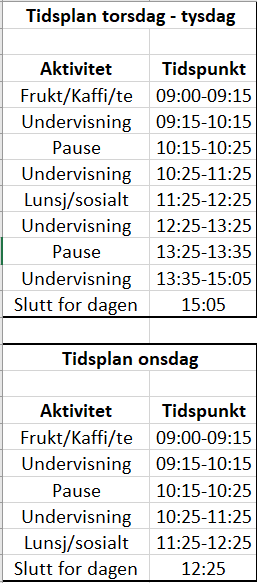

# AS
Sommerkurs Amalie Skram VGS, Matematikk 1T

# Timeplan

# Oppgaver
## Tall og algebra
Oppgaver finnes her: https://api.ndla.no/files/resources/AnMqmSMceaC9tU6T.pdf

Gjør oppgavene

**Dag 1:** 1.1.1-1.1.5, 1.1.30-1.1.41, 1.1.100, 1.1.101, 1.1.110, PO-1 - PO-8, PO-60, PO-61, PO-70 - PO-76,

**Dag 2:** 1.5.2, 1.5.3adf, 1.5.5ade, 15.6cd, 1.5.9, 1.5.11, 1.5.16

## Funksjonslære

## Programmering

[Emneevaluering, lag skjema]: #
